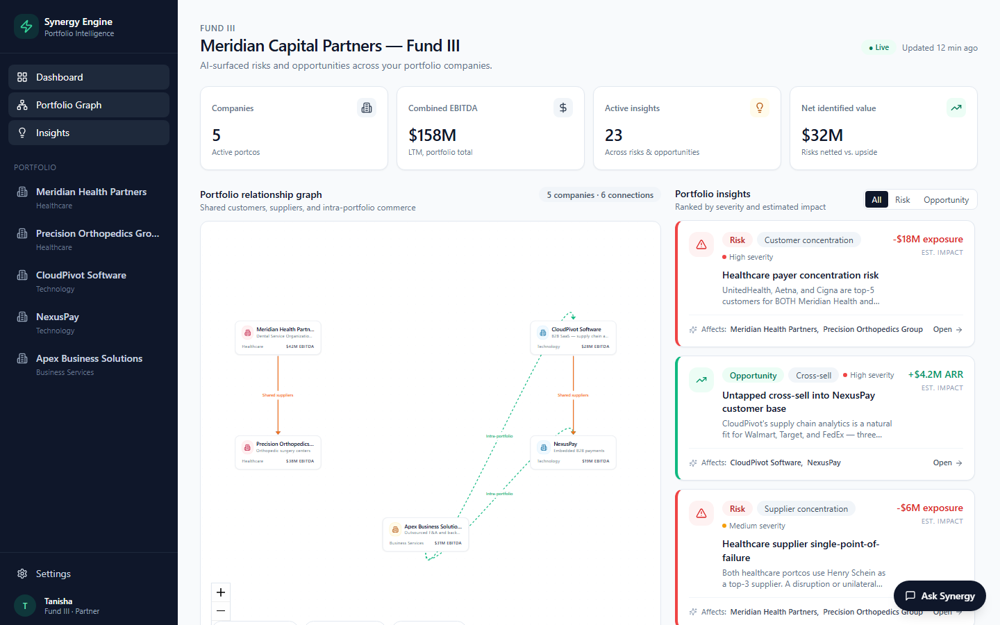
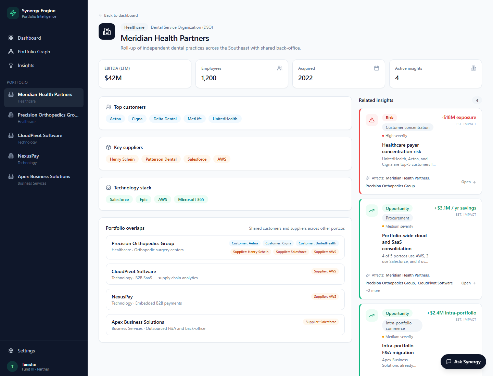
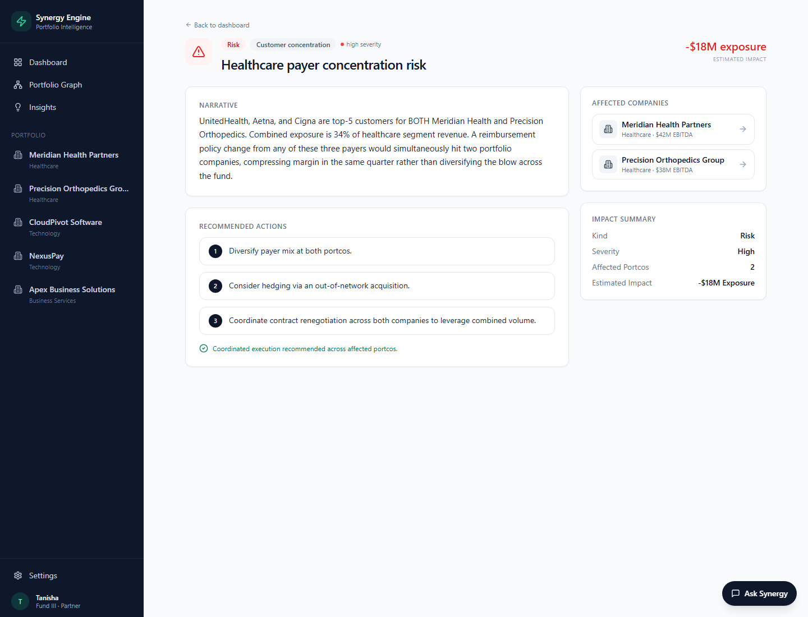
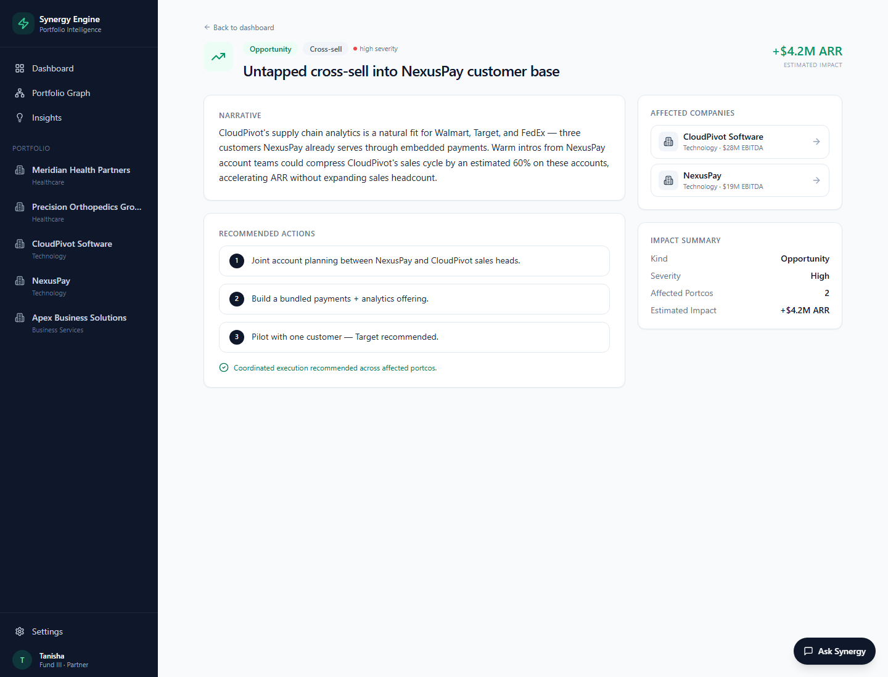
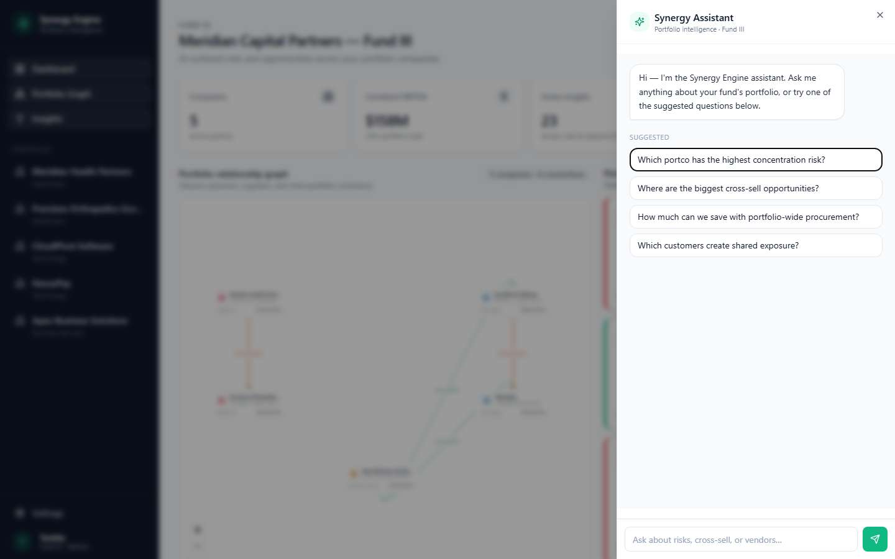
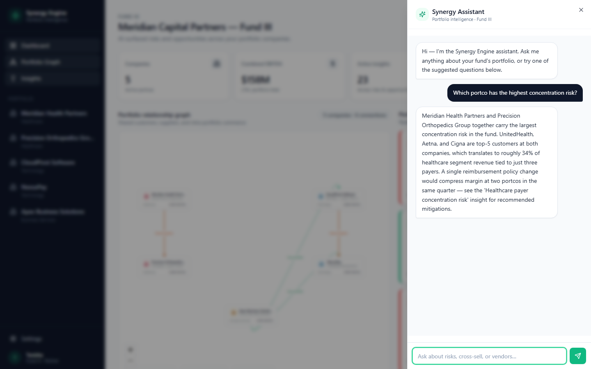
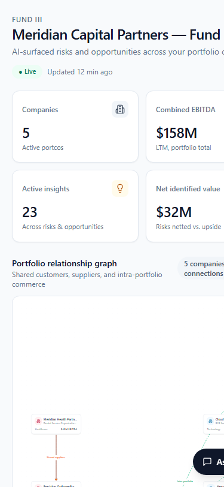

# Synergy Engine

**AI portfolio intelligence for private equity.**
A portfolio company relationship mapper that surfaces hidden risks and opportunities across a PE firm's investments.



Built for *Meridian Capital Partners — Fund III*, a hypothetical 5-company portfolio:

| Company | Sector | EBITDA |
|---|---|---|
| Meridian Health Partners | Healthcare — Dental DSO | $42M |
| Precision Orthopedics Group | Healthcare — Surgery centers | $38M |
| CloudPivot Software | Technology — B2B SaaS | $28M |
| NexusPay | Technology — Embedded payments | $19M |
| Apex Business Solutions | Business Services — Outsourced F&A | $31M |

---

## What it does

Most PE firms manage portfolio companies in isolation. Synergy Engine sits on top of the whole fund and surfaces things you can only see when you look across all portcos at once:

- **Concentration risks** — e.g. UnitedHealth is a top customer at *two* portcos, which means one reimbursement change hits the fund twice
- **Cross-sell opportunities** — e.g. NexusPay's customer relationships at Walmart and Target are warm intros for CloudPivot
- **Procurement leverage** — e.g. 4 of 5 portcos run on AWS, ~$3.1M/year savings from a fund-level enterprise agreement
- **Intra-portfolio commerce** — e.g. migrating both healthcare portcos to Apex for F&A

The dashboard renders the relationship graph (shared customers in blue, shared suppliers in orange, intra-portfolio commerce in emerald) alongside a ranked list of 5 hand-curated insights. A floating chat assistant answers the 4 most common partner questions.

---

## Screens

### Portfolio company detail
Each portco gets a dedicated page with customers, suppliers, tech stack, and a *portfolio overlaps* section that surfaces every shared customer/supplier with every other portco in the fund.



### Insight detail — risk
High-severity risks render with the full narrative, three numbered recommended actions, and a list of the affected portcos.



### Insight detail — opportunity
Opportunities use the same template but with emerald accents and an ARR/savings impact.



### Floating chat assistant
Click *Ask Synergy* bottom-right. The drawer opens with 4 suggested questions tied to the insights above.



Click a chip and the assistant answers with a full, multi-sentence response that references the underlying insight.



### Mobile
Fully responsive — the sidebar collapses and the layout stacks on phone widths.



---

## Stack

- **Next.js 14** (App Router) + TypeScript
- **Tailwind CSS** + shadcn/ui–style primitives
- **React Flow** for the portfolio graph
- **Radix UI** for the chat drawer (Sheet) and tabs
- **lucide-react** for icons
- All data is hardcoded in `lib/data.ts` — no APIs, no env variables, no database

---

## Run locally

You need **Node.js 18+** installed: https://nodejs.org

```bash
# 1. install dependencies (once)
npm install

# 2. start the dev server
npm run dev

# 3. open http://localhost:3000
```

The terminal must stay open — closing it stops the server.

If port 3000 is taken:

```bash
npm run dev -- -p 3001
```

### Windows one-click

Double-click **`start.bat`** in the project root. It installs deps if needed, starts the dev server, and opens your browser.

---

## Project structure

```
app/
  layout.tsx              # sidebar + chat drawer shell
  page.tsx                # dashboard: stats + graph + insights list
  portco/[id]/page.tsx    # company detail page
  insight/[id]/page.tsx   # insight detail page
components/
  PortfolioGraph.tsx      # reactflow graph
  InsightCard.tsx         # single insight tile
  InsightsList.tsx        # filterable list of insights
  ChatDrawer.tsx          # floating "Ask Synergy" assistant
  Sidebar.tsx             # left nav + portfolio list
  ui/                     # card, button, badge, sheet, tabs
lib/
  data.ts                 # 5 portcos, 5 insights, edges, chat responses
  types.ts                # shared TypeScript types
  utils.ts                # cn() + money formatter
```

---

## The 5 hardcoded insights

1. **Healthcare payer concentration risk** — High severity, –$18M exposure. UnitedHealth/Aetna/Cigna sit at the top of two healthcare portcos.
2. **Untapped cross-sell into NexusPay customer base** — High severity, +$4.2M ARR. CloudPivot can ride NexusPay's customer relationships at Walmart, Target, and FedEx.
3. **Portfolio-wide cloud and SaaS consolidation** — Medium severity, +$3.1M/year. Fund-level AWS + Salesforce + Snowflake EA.
4. **Intra-portfolio F&A migration** — Medium severity, +$2.4M. Move both healthcare portcos to Apex Business Solutions.
5. **Healthcare supplier single-point-of-failure** — Medium severity, –$6M exposure. Both healthcare portcos depend on Henry Schein.

---

## Deploy to Vercel

Zero config:

```bash
npm install -g vercel
vercel
```

Or connect the GitHub repo at https://vercel.com/new — Next.js is auto-detected.

---

## License

MIT
